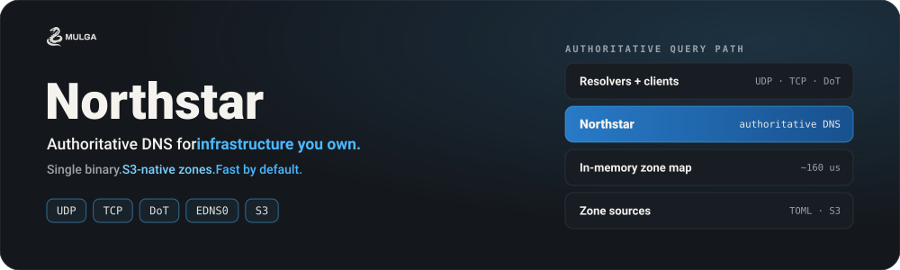
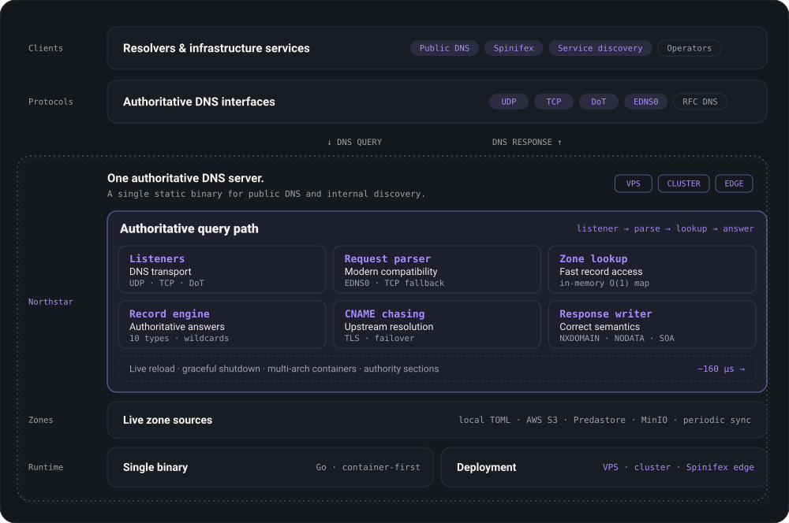

<p align="center">
  
</p>

<p align="center">
  <a href="https://go.dev"></a>
  <a href="LICENSE"></a>
  <a href="https://mulgadc.com"></a>
</p>

<p align="center">
  <a href="#why-northstar">Why Northstar?</a> ·
  <a href="#quick-start">Quick start</a> ·
  <a href="#protocol-and-record-support">Protocol support</a> ·
  <a href="#architecture">Architecture</a> ·
  <a href="#configuration">Configuration</a> ·
  <a href="#zone-file-format">Zone files</a> ·
  <a href="#spinifex-integration">Spinifex integration</a> ·
  <a href="#docker">Docker</a> ·
  <a href="#development">Development</a> ·
  <a href="#roadmap">Roadmap</a> ·
  <a href="https://docs.mulgadc.com">Docs</a>
</p>

---

# Northstar: Fast, lightweight authoritative DNS for infrastructure you control.

Northstar is an authoritative DNS server written in Go. It serves zones from local TOML files or S3-compatible storage over UDP, TCP and DNS-over-TLS.

It can run independently or provide authoritative DNS and service discovery for a Spinifex installation.

## Why Northstar?

- **Self-hosted DNS done right** — Run your own authoritative nameserver without the operational complexity of BIND or PowerDNS. Zone files are human-readable TOML, configuration is environment variables, and the whole thing deploys as a single container.
- **S3-native zone management** — Store zone files in AWS S3, [Predastore](https://github.com/mulgadc/predastore/), MinIO, or any S3-compatible backend. Northstar syncs automatically, so you can manage DNS records through the same object storage pipeline as the rest of your infrastructure.
- **Built for [Spinifex](https://github.com/mulgadc/spinifex)** — Northstar serves as the DNS backbone for Spinifex, an open-source AWS alternative. It handles both internal service discovery (SRV records for NATS, gateways, and other cluster services) and public-facing authoritative DNS, all from the same instance.
- **Plays nice with public resolvers** — Full RFC compliance means Cloudflare (1.1.1.1), Google (8.8.8.8), and every other recursive resolver can properly resolve your domains. TCP fallback, EDNS0, correct NXDOMAIN/NODATA semantics, proper authority sections — the things that matter when your DNS needs to actually work on the real internet.

## Quick start

```bash
git clone https://github.com/mulgadc/northstar
cd northstar
make build
ZONE_DIR="./config/domains" ./bin/northstar
```

Query the running server:

```bash
dig @127.0.0.1 hello_a.net A
dig @127.0.0.1 hello_a.net A +tcp
dig @127.0.0.1 hello_a.net A +edns=0
```
## Capabilities

- Authoritative DNS over UDP and TCP
- DNS-over-TLS
- EDNS0
- Local TOML zone files
- S3-compatible zone storage
- Filesystem reload and periodic S3 synchronisation
- Wildcard records with exact-match priority
- Configurable upstream resolvers with TLS and failover
- Graceful shutdown
- Container deployment and single-binary distribution

## Protocol and record support

### Protocols

- DNS over UDP
- DNS over TCP
- DNS over TLS
- EDNS0

### Record types

| Type | Code | Primary fields |
| --- | ---: | --- |
| A | 1 | `address` (IPv4) |
| NS | 2 | `address` (nameserver FQDN) |
| CNAME | 5 | `address` (target FQDN) |
| SOA | 6 | Generated from the `[domain]` section |
| PTR | 12 | `address` (target FQDN) |
| MX | 15 | `address`, `preference` |
| TXT | 16 | `address` (text value) |
| AAAA | 28 | `address` (IPv6) |
| SRV | 33 | `address`, `priority`, `weight`, `port` |
| CAA | 257 | `address`, `caa_flag`, `caa_tag` |

## Architecture

<p align="center">
  
</p>

Northstar loads authoritative zone data into an in-memory lookup structure.
Zones can be read from the local filesystem or retrieved from an S3-compatible
backend. Requests are accepted over UDP, TCP or DNS-over-TLS and answered from
the authoritative zone store.

Optional upstream resolvers can be configured with TLS and failover for CNAME
chasing.

## Configuration

All configuration is via environment variables.

### Core

| Variable | Default | Description |
|----------|---------|-------------|
| `ZONE_DIR` | `config/domains/` | Path to zone files or `s3://bucket-name` |
| `HOST` | `0.0.0.0` | Listen address |
| `PORT` | `53` | Listen port (UDP + TCP) |
| `NORTHSTAR_LOG_IGNORE` | | Suppress all logging |
| `NORTHSTAR_LOG_DEBUG` | | Enable debug logging |

### DNS-over-TLS

| Variable | Default | Description |
|----------|---------|-------------|
| `NORTHSTAR_TLS_CERT` | | Path to TLS certificate (PEM) |
| `NORTHSTAR_TLS_KEY` | | Path to TLS private key |
| `DOT_PORT` | `853` | DoT listener port |

### S3 / S3-Compatible Storage

| Variable | Default | Description |
|----------|---------|-------------|
| `AWS_ACCESS_KEY` | | AWS access key ID |
| `AWS_SECRET_ACCESS_KEY` | | AWS secret access key |
| `AWS_REGION` | | AWS region |
| `NORTHSTAR_S3_ENDPOINT` | | Custom S3 endpoint URL (for Predastore, MinIO, etc.) |
| `NORTHSTAR_S3_INSECURE` | | Standalone environment mode only: skip S3 TLS certificate verification |
| `S3_SYNC_RETRY` | `60` | S3 sync interval in seconds |

### Upstream Resolvers

| Variable | Default | Description |
|----------|---------|-------------|
| `NORTHSTAR_UPSTREAM` | `tls://1.1.1.1:853,tls://8.8.8.8:853,1.1.1.1:53` | Comma-separated upstream servers for CNAME chasing. Prefix with `tls://` for DNS-over-TLS. |

## Zone File Format

Zone files use TOML. Each file represents one zone and is named `<domain>.toml`.

```toml
version = 1.0

[domain]
domain = "example.com"
soa = "ns1.example.com."
created = 2024-01-01T00:00:00Z
modified = 2024-06-15T12:00:00Z
verified = true
active = true
ownerid = 1

[defaults]
ttl = 3600
type = 1    # A record
class = 1   # IN

# A records
[[records]]
domain = ""
address = "203.100.1.1"

[[records]]
domain = "www."
address = "203.100.1.1"

# Wildcard — matches any subdomain without an explicit record
[[records]]
domain = "*."
address = "203.100.1.99"

# NS records
[[records]]
domain = ""
type = 2
address = "ns1.example.com."

[[records]]
domain = ""
type = 2
address = "ns2.example.com."

# MX records
[[records]]
domain = ""
type = 15
preference = 10
address = "mail.example.com."

# TXT records (SPF, DKIM, verification, etc.)
[[records]]
domain = ""
type = 16
address = "v=spf1 mx a -all"

# AAAA record
[[records]]
domain = ""
type = 28
address = "2001:db8::1"

# SRV record (service discovery)
[[records]]
domain = "_nats._tcp."
type = 33
priority = 10
weight = 0
port = 4222
address = "node1.example.com."

# CAA record (certificate authority authorization)
[[records]]
domain = ""
type = 257
caa_flag = 0
caa_tag = "issue"
address = "letsencrypt.org"

# PTR record (reverse DNS — in a separate zone file for in-addr.arpa)
# [[records]]
# domain = "1."
# type = 12
# address = "host-1.example.com."
```

### Record Type Reference

| Type | Code | Fields |
|------|------|--------|
| A | 1 | `address` (IPv4) |
| NS | 2 | `address` (nameserver FQDN) |
| CNAME | 5 | `address` (target FQDN) |
| SOA | 6 | Auto-generated from `[domain]` section |
| PTR | 12 | `address` (target FQDN) |
| MX | 15 | `address` (mail server FQDN), `preference` |
| TXT | 16 | `address` (text value) |
| AAAA | 28 | `address` (IPv6) |
| SRV | 33 | `address` (target FQDN), `priority`, `weight`, `port` |
| CAA | 257 | `address` (CA domain), `caa_flag`, `caa_tag` |

## Spinifex Integration

Northstar serves as the DNS layer for [Spinifex](https://github.com/mulgadc/spinifex), providing both internal service discovery and public authoritative DNS.

**Service discovery with SRV records:**

```toml
# _nats._tcp.spinifex.spx3.net → node1.spinifex.spx3.net:4222
[[records]]
domain = "_nats._tcp.spinifex."
type = 33
priority = 10
weight = 0
port = 4222
address = "node1.spinifex.spx3.net."

# _awsgw._tcp.spinifex.spx3.net → node1.spinifex.spx3.net:9999
[[records]]
domain = "_awsgw._tcp.spinifex."
type = 33
priority = 10
weight = 0
port = 9999
address = "node1.spinifex.spx3.net."
```

**Using Predastore as the zone file backend:**

Mulga's S3-compatible storage ([Predastore](https://github.com/mulgadc/predastore)) can serve as the zone file backend, keeping DNS configuration alongside the rest of the Spinifex infrastructure. Northstar verifies the endpoint certificate using the system trust store; install a private CA there or provide it with `SSL_CERT_FILE` / `SSL_CERT_DIR`:

```sh
ZONE_DIR="s3://dns-zones" \
NORTHSTAR_S3_ENDPOINT="https://predastore.spinifex.spx3.net:8443" \
SSL_CERT_FILE="/path/to/spinifex-ca.pem" \
AWS_ACCESS_KEY="..." \
AWS_SECRET_ACCESS_KEY="..." \
AWS_REGION="us-west-1" \
./bin/northstar
```

## Docker

**Docker Compose (S3):**

```sh
AWS_ACCESS_KEY="X" AWS_SECRET_ACCESS_KEY="Y" ZONE_DIR="s3://my-bucket" AWS_REGION="us-west-1" docker compose up -d
```

**Standalone (filesystem):**

```sh
docker run \
  --mount src=./config/domains,target=/config/domains,type=bind \
  -e ZONE_DIR="/config/domains" \
  -p 53:53/udp -p 53:53/tcp \
  calacode/northstar-dns
```

**With DNS-over-TLS:**

```sh
docker run \
  --mount src=./config/domains,target=/config/domains,type=bind \
  --mount src=./certs,target=/certs,type=bind \
  -e ZONE_DIR="/config/domains" \
  -e NORTHSTAR_TLS_CERT="/certs/server.pem" \
  -e NORTHSTAR_TLS_KEY="/certs/server.key" \
  -p 53:53/udp -p 53:53/tcp -p 853:853/tcp \
  calacode/northstar-dns
```

## Development

```sh
make test          # Unit tests
make test-race     # Unit tests with the race detector
make test-cover    # Unit tests with coverage (fails below threshold)
make lint          # golangci-lint (use `make fix` to auto-fix)
make govulncheck   # Dependency vulnerability scan
make bench         # Benchmarks
make e2e           # E2E tests via Docker (Predastore + Northstar)
make preflight     # lint + govulncheck + coverage + race
```

## Benchmarking

```sh
make bench
```

Simulates 26 domains with ~255 subdomains each:

```
name           time/op
DNSQueryA-8     160µs ±12%
DNSQueryTXT-8   172µs ±19%
DNSQueryMX-8    162µs ±12%

name           alloc/op
DNSQueryA-8    3.09kB ± 0%
DNSQueryTXT-8  3.68kB ± 0%
DNSQueryMX-8   4.05kB ± 0%
```

## Roadmap

See [DEV.md](DEV.md) for the full development plan.

- [ ] DNS-over-HTTPS (DoH)
- [ ] DNSSEC signing
- [ ] Prometheus metrics endpoint
- [ ] Rate limiting / DDoS protection
- [ ] Dynamic record API (HTTP)
- [ ] Split-horizon DNS (internal vs external views)
- [ ] Health-aware DNS responses
- [ ] Response caching

Roadmap items describe direction and are not commitments to a release date.

## License

Northstar is licensed under the [GNU Affero General Public License v3.0 (AGPLv3)](LICENSE) license.
